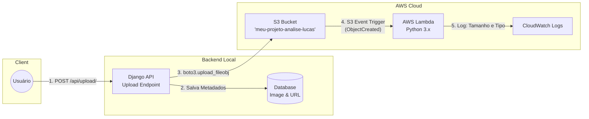

# Cloud Image Analyzer ☁️📸

[]()
[]()
[]()

Um projeto completo integrando **Django (Backend API)** com a infraestrutura e automação Serverless da **AWS**. 
Os usuários fazem o upload de uma imagem via API, que é salva diretamente no **Amazon S3**. A adição do arquivo no bucket dispara automaticamente uma função **AWS Lambda** em Python que extrai informações (tamanho e tipo da imagem) e gera logs no **Amazon CloudWatch**.

---

## 🏗️ Arquitetura do Projeto

Abaixo está o fluxo da comunicação desde o endpoint da API até a nuvem serverless:



---

## 🚀 Passo a Passo da Implementação

### 1. O Coração (Django API)

O backend do projeto automatiza o envio da imagem do lado do servidor via `boto3`.

1. **Instalação Local**:
   O projeto já vem com as requisições configuradas. As dependências são:
   ```bash
   pip install django djangorestframework boto3 django-cors-headers python-dotenv
   ```
2. **Modelo da API (`api/models.py`)**:
   Salva o nome do arquivo enviado e a URL pública gerada no S3.
3. **Endpoint (`api/views.py`)**:
   Recebe o arquivo em memória (`request.FILES`) e usa a SDK da AWS para enviar o arquivo diretamente ao bucket S3 sem gravá-lo no disco local.

> Para rodar a aplicação localmente:
> 1. Preencha o arquivo `.env` na raiz do projeto configurando suas chaves **AWS_ACCESS_KEY_ID**, **AWS_SECRET_ACCESS_KEY**, a Região e o Nome do Bucket.
> 2. Execute `python manage.py runserver`

### 2. A Infraestrutura (AWS S3)

Para guardar as imagens, a infraestrutura S3 e as permissões IAM da AWS precisam ser criadas.

1. Acesse o [Console da AWS S3](https://console.aws.amazon.com/s3/).
2. Crie um Bucket chamado: `meu-projeto-analise-lucas`.
3. **Políticas IAM**: 
   - Vá no serviço **IAM** (Identity and Access Management).
   - Crie um novo `User` com `Access key - Programmatic access`.
   - Anexe a policy administrada: `AmazonS3FullAccess` (para permitir que o script em Django envie os arquivos).
   - Copie as credenciais fornecidas no final e guarde-as no `.env`.

### 3. Automação Serverless (AWS Lambda)

O script presente em `/lambda/lambda_function.py` faz a mágica Serverless após a imagem ser upada no bucket S3.

1. Na seção do **AWS Lambda** no console AWS, crie uma função com o *Runtime* `Python 3.x`.
2. Em **Permissions** (Execution Role), escolha ou crie uma role que tenha as seguintes Policies atreladas:
   - `AWSLambdaBasicExecutionRole` (Para poder gerar saídas em CloudWatch Logs).
   - `AmazonS3ReadOnlyAccess` (Opcional, mas útil caso precise usar s3_client na Lambda).
3. **Adicionando o Trigger**:
   - Vá em *Add trigger* na interface da Lambda.
   - Escolha **S3**; Selecione o seu bucket (`meu-projeto-analise-lucas`).
   - Configure o tipo de evento para *All object create events* (`s3:ObjectCreated:*`).
4. **Deploy**:
   - Copie o conteúdo de `lambda/lambda_function.py` para dentro da AWS Lambda, clique em Deploy.
   - Toda imagem enviada no `/api/upload/` ativará essa função e você verá os registros no *Amazon CloudWatch*.

---

> Desenvolvido com foco no exame de Cloud Architecture & Solutions Operations! ☁️
